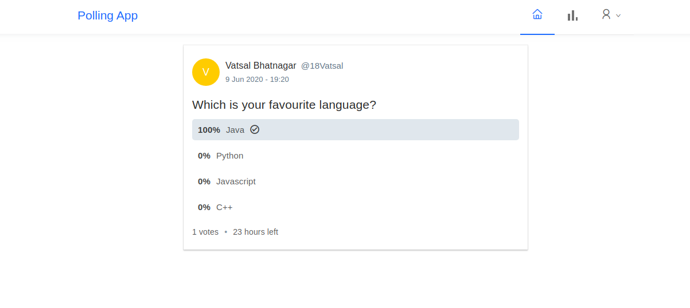

## A Full Stack Polls app similar to twitter polls with Spring Boot, Spring Security, JWT, React and Ant Design.



## Steps to Setup the Spring Boot Back end app (polling-app-server)

1. **Clone the application**

	```bash
	git clone https://github.com/23Vatsal/Polling-Application.git
	```

2. **Create MySQL database**

	```bash
	create database polling_app
	```

3. **Change MySQL username and password as per your MySQL installation**

	+ open `src/main/resources/application.properties` file.

	+ change `spring.datasource.username` and `spring.datasource.password` properties as per your mysql installation

4. **Run the app**

	You can run the spring boot app by typing the following command -

	```bash
	mvn spring-boot:run
	```

	The server will start on port 8080.
  5. **Default Roles**
	
	The spring boot app uses role based authorization powered by spring security. To add the default roles in the database, I have added the following sql queries in `src/main/resources/data.sql` file. Spring boot will automatically execute this script on startup -

	```sql
	INSERT IGNORE INTO roles(name) VALUES('ROLE_USER');
	INSERT IGNORE INTO roles(name) VALUES('ROLE_ADMIN');
	```

	Any new user who signs up to the app is assigned the `ROLE_USER` by default.

## Steps to Setup the React Front end app (polling-app-client)

First go to the `polling-app-client` folder -

```bash
cd polling-app-client
```

Then type the following command to install the dependencies and start the application -

```bash
npm install && npm start
```

The front-end server will start on port `3000`.
<br>
<br>
Took help from online resources :-<br>
www.callicoder.com <br>
www.tutorialspoint.com
Maja Aagya dekh ke
